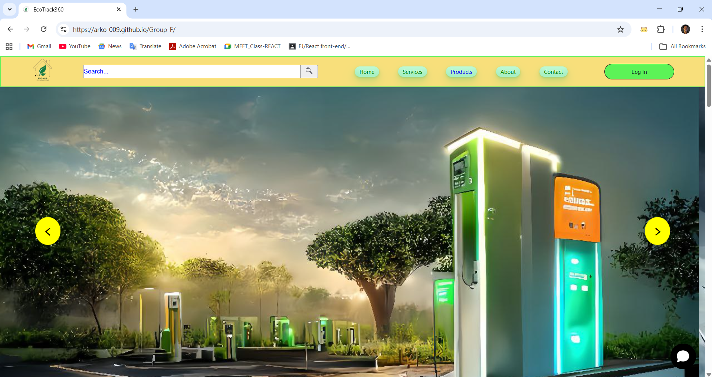
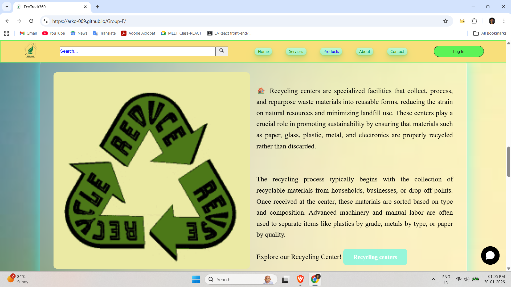
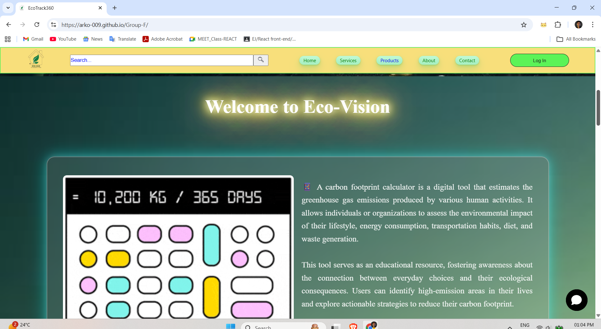
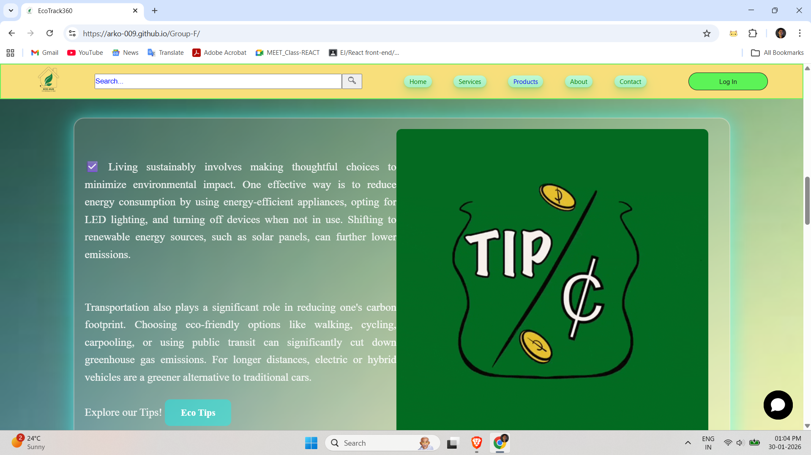
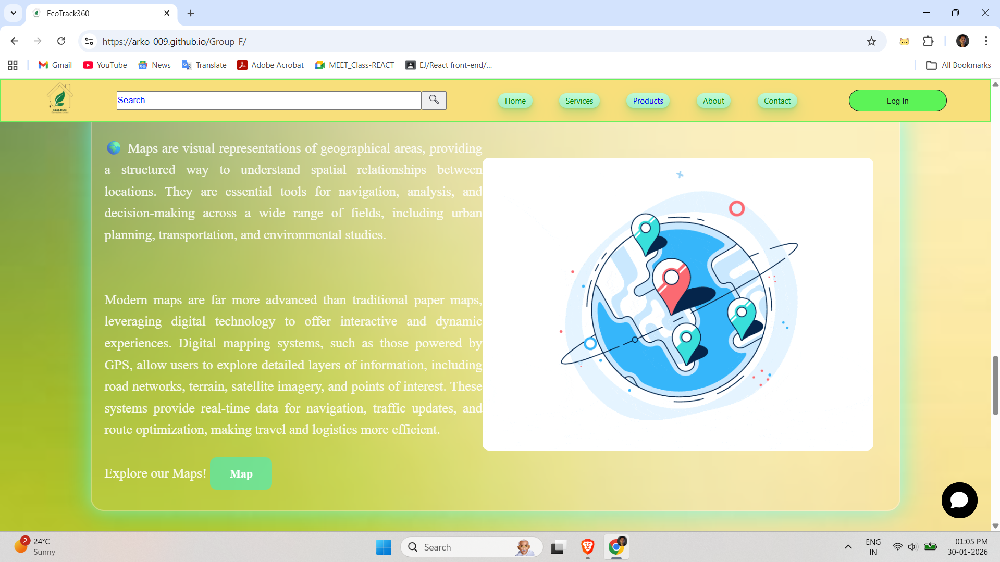
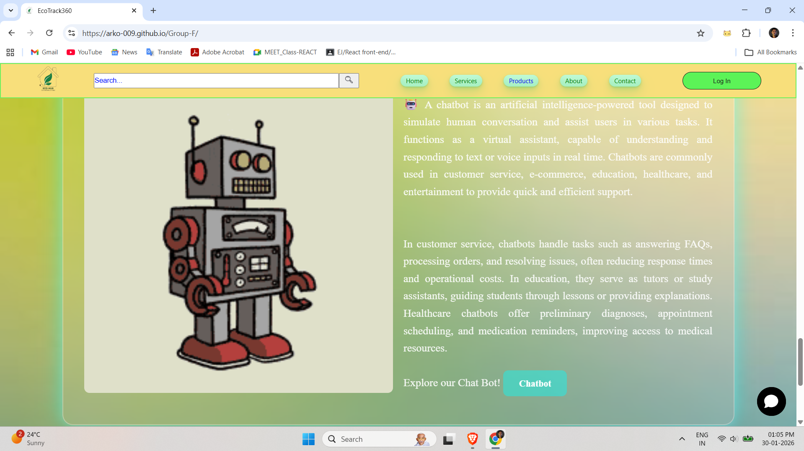

🌱 EcoTrack360 (Eco-Vision)

EcoTrack360 is a front-end eco-awareness web application designed to promote sustainable living by educating users about carbon footprint reduction, recycling, eco-friendly habits, and smart environmental choices — all in one visually engaging platform.

🔗 Live Demo --

👉 Visit Live Website:
https://arko-009.github.io/Group-F/

🚀 Features --
🌍 Eco Awareness Hub – Clear explanations of sustainability concepts in simple language

♻️ Recycling Center Info – Learn how recycling works and why it matters

📊 Carbon Footprint Insights – Understand daily activities and their environmental impact

💡 Eco Tips Section – Practical, real-life tips for sustainable living

🗺️ Map Section – Visual representation of locations and eco resources

🤖 Chatbot Concept Section – Showcasing AI-assisted eco guidance ideas

🎨 Clean & Responsive UI – Smooth layout with modern design aesthetics

🛠️ Tech Stack --
HTML5 – Structure & content
CSS3 – Styling, layout, responsiveness
JavaScript (Vanilla) – Interactivity & logic
(No frameworks. Pure fundamentals 💪)

🎯 Purpose of This Project --
> This project was built to:
> Strengthen front-end fundamentals
> Practice real-world UI structuring
> Promote environmental awareness through technology

📌 Future Improvements (Optional Section) --
> Add real carbon footprint calculator logic
> Integrate live recycling center APIs
> Convert to React for scalability
> Add backend & user authentication

👨‍💻 Author
Arko Bag

